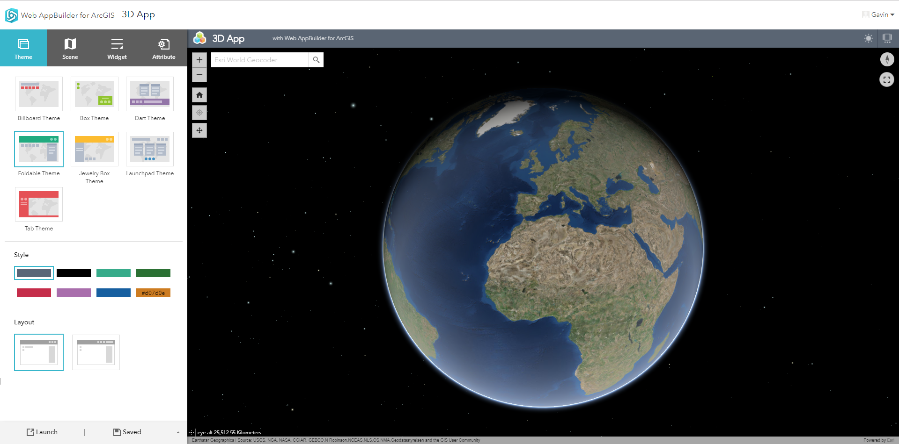

## Web AppBuilder

---

<!-- .element style="margin: 0; height: -webkit-fill-available;" -->

Note:
Image from https://github.com/emojione/emojione/tree/2.2.7

---

<!-- .slide: data-background="./img/heart-puzzle.jpg" -->

Note: Image from https://pixabay.com/en/puzzle-heart-love-two-hearts-1721592/ (Free for commercial use ; No attribution required)